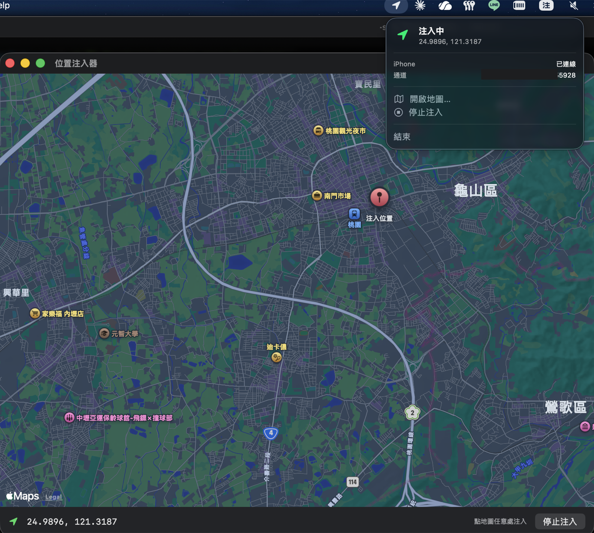

# locspoof — Trick your iPhone into thinking it's anywhere

[正體中文](README_zh.md)

[](LICENSE)
[](https://www.apple.com/macos/)
[](https://swift.org)

System-wide iPhone GPS spoofing, controlled from your Mac. Apple Maps, Google Maps, Find My, your dating app — every one of them happily reads whatever coordinate you point at on a map. **No jailbreak.** No App Store sideloading detours. Just Apple's own Developer Tools (DVT) plumbing, repurposed.



There are two ways to use it. They share the same DVT mechanism underneath, so picking one is a matter of taste:

| | `host/` CLI | `locspoof/` Mac app |
|---|---|---|
| How you run it | `sudo python3 host/start.py` | Click a menu bar icon. Click a map. |
| Sudo prompts | Every single time | Once, ever |
| UI | Leaflet in a browser tab | Native menu bar + MapKit |
| Best for | Devs and "I live in the terminal" types | "I'd like an app icon, thanks" |

## Quick start

iPhone needs a one-time pairing handshake plus a Developer Mode toggle either way. Apple's docs are scattered across forum posts from 2018, so we wrote our own version: see [docs/INSTALL.md](docs/INSTALL.md).

**CLI:**

```bash
sudo python3 host/start.py
# then open http://127.0.0.1:8765/
```

**Mac app:**

```text
1. Open kc_locationspoof.xcodeproj in Xcode
2. Signing & Capabilities → set your own Team ID (on both targets)
3. cmd+B
4. Drag locspoof.app into /Applications/
5. Click the menu bar icon → "安裝 Helper" once → done
```

## Docs

- [INSTALL.md](docs/INSTALL.md) — full setup, including the iPhone pairing dance
- [ARCHITECTURE.md](docs/ARCHITECTURE.md) — internals, plus the code-signing landmines we stepped on so you don't have to
- [SECURITY.md](docs/SECURITY.md) — what third-party binaries we ship, how we audited them, and how to rebuild from upstream if you want to verify everything yourself

## Security notice

We bundle two third-party PyInstaller binaries (`pymobiledevice3` from [doronz88](https://github.com/doronz88/pymobiledevice3) and `dvt-location-stream` from [O.Paperclip](https://github.com/agocia/O.paperclip)) and run them as a root LaunchDaemon. That's a lot of trust to extend to upstream. Source for both is publicly auditable; we did the audit and found nothing weird. **If you want to be really sure, rebuild from upstream source yourself** — instructions in [docs/SECURITY.md](docs/SECURITY.md).

Found a security issue? Please use [GitHub Security Advisories](../../security/advisories/new) for private disclosure, not a public issue.

## License

GPL-3.0. We ship a derivative of `pymobiledevice3` (which is GPL-3.0), so the whole project is too. Full text in [LICENSE](LICENSE).

Standing on the shoulders of:

- [doronz88/pymobiledevice3](https://github.com/doronz88/pymobiledevice3) — the actual iOS DVT plumbing (GPL-3.0)
- [agocia/O.paperclip](https://github.com/agocia/O.paperclip) — the `dvt-location-stream` wrapper plus the PyInstaller recipe (MIT)

**Use this for honest things.** Development testing, location privacy, convincing Find My you're at home when you're really at the coffee shop. Don't use it for fraud, location-based game cheating, or anything that would make Apple's Terms of Service team furious. They have feelings too.
